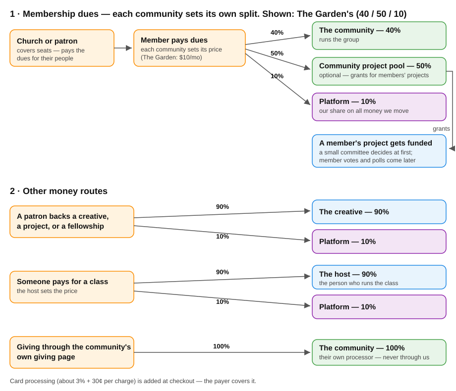

# creatives.exchange — the plan

*For conversations with community partners.*
*v0.5 · 2026-09-08 · owner: Rick*

This is the plan as it stands. Open questions are at the end. Everything above them is how it works.

---

## 1 · What it is

**creatives.exchange is the platform. Communities live on top of it. People hold one account and can take part in many communities.**

| Layer | What it is | Who controls it |
|---|---|---|
| **creatives.exchange** | The platform: accounts, payments, permission rules, and the tools every community uses | Us |
| **Community** | A group with its own name, style, language, rules, and members. Run by an organization or a leader. Examples: The Garden, Abiding Practice, Table Art Society | The community |
| **Class** | A gathering with a roster: a six-week course, or a critique group that meets every Tuesday | The host — the person who runs it |
| **Member** | A person: a creative or a patron | The person |

**Three words, kept straight:** a **community** is the group. The **organization** (or leader) behind it runs it. A **host** is a person who runs a class inside it. In a small community, that can all be the same person wearing three hats.

**Five kinds of things happen on the platform:**

- **Events** — one-time happenings. Public ones need no account.
- **Classes and counseling** — ongoing learning, in groups or one-on-one. (Abiding Practice calls theirs Practice and Pathfinding.)
- **Projects** — creative work. A passion project is unpaid and looks for backing; a paid project comes with a budget.
- **Jobs** — paid gigs. Post one, or apply to one. Jobs are their own thing, not projects.
- **Offers** — things members make available: a room, gear, coaching hours.

**The platform itself is not only for Christians.** Each community sets its own values. We launch with the Christian creatives community up front: The Garden, along with Abiding Practice and Table Art Society.

People feel they joined their community, not the platform. The platform's name shows up on receipts and the public ledger — it runs underneath. The closest comparison is Skool: you join communities, and the platform runs under them. The difference is what moves through it. Skool moves content and payments. We move money to real creative work, in the open.

Your profile, portfolio, and funded work belong to you and travel with you across communities. No community owns a person. There is no algorithmic feed and there are no follower counts. Things sort by time and place.

## 2 · Joining and paying

**A free account gets you a lot.** Browse everything public, keep a portfolio, join free communities, sit in open classes, go to public events, and read job postings. Free forever.

**You pay each community you join as a member — unless that community is free.** Each community sets its own membership price. The Garden charges $10 a month. Join three paid communities, pay three times — the same way you pay for each class you take.

**What membership gets you:** that community's members-only classes and private events — and, if the community runs a project pool, the right to ask it to back your work. Members can be backed by patrons and can apply to paid jobs.

**There is a payment gate.** The app checks at the door: joining a paid class, entering a private event, or asking for support all require you to pay or join first. This is partly built already.

**A covered seat is a full seat.** When a church or patron pays someone's membership, that person can do everything a self-paying member can. Sponsorship changes who pays — never what you can do.

**Churches buy seats for their people.** A church buys a number of seats in a community — at launch, usually The Garden — and hands out codes. Using a code makes you a member there.

**Job postings are public. Applying takes membership.** Anyone can read what work is out there and what it pays. Seeing the work is the reason to join.

## 3 · How the money works

**Who pays, who earns:**

| Who | Pays | Earns |
|---|---|---|
| Free member | $0 | — |
| Member | That community's price, per community they join (The Garden: $10/mo) | Backings, fellowships, and paid jobs — 90% to them |
| Host | $0 — hosting is never rented | 90% of what their classes collect |

**Where every dollar goes:**

| Money in | Split |
|---|---|
| Membership dues | **10% platform.** The other 90% belongs to the community, and each community decides how much runs the group and how much, if any, feeds a project pool. The Garden's split: **40% runs the group · 50% project pool · 10% platform** |
| A patron backs a creative, project, or fellowship | **90% the work · 10% platform** |
| A class fee | **90% the host · 10% platform** |
| A patron pays a creative directly (we made the connection) | **100% the creative** — we record it on the ledger and take nothing |
| Giving through the community's own giving page | **100% the community** — this money never passes through us (spelled out below) |

**On project money, we mostly facilitate at this stage.** A paid project or a fellowship can be arranged straight between the patron and the creative: they agree, the patron pays them directly, and we record it and show it on the public ledger. We take nothing on money we don't move. The 10% applies when money moves through our checkout — dues, class fees, backings paid on the platform. Over time more of it can move through us; for now, making the connection is the job.

**Card processing is separate, and the payer covers it.** The card processor charges about 3% + 30¢ per charge, added at checkout — the way most platforms do it. So the platform's 10% is a real 10%, not 10% minus card fees. If we absorbed card fees, small monthly charges would eat most of our share and the platform couldn't run — the financial model shows exactly this. Annual billing keeps processing costs low.

**A project pool is optional.** Not every community wants a grant fund. Each community decides whether it runs one and how big the share is. The Garden puts half its dues into its pool.

**Who hands out pool money:** at first, a small committee in each community decides which projects get grants. Later we add member votes and polls.

**The community's own giving page, spelled out:** some communities already take donations through their own giving provider — a church giving platform, for example. That money goes from the giver, through the community's own processor, into the community's own bank account. It never touches our system, and we take nothing from it. What we do is show the giving link on the community's page and, when the community shares the records, list what got funded on the public ledger.

**Worked examples** (card processing is added at checkout in each case):

| The move | Money in | Platform | The rest |
|---|---|---|---|
| A Garden member for a year ($10/mo) | $120 | $12 | $48 The Garden · $60 its project pool |
| A $500 fellowship | $500 | $50 | $450 to the creative |
| A 12-person class at $120 | $1,440 | $144 | $1,296 to the host |
| A church covers 10 Garden seats for a year | $1,200 | $120 | $480 The Garden · $600 its pool |

**Every funding move is public.** Patrons back a named person or project, and every grant and backing lands on a ledger anyone can read without an account.

**Every community keeps at least one open, free class** — a room anyone can walk into without paying. Required.

**Why someone pays:** you can always show up free. You pay when you want your work funded. That pitch only works if money is actually moving — so we bring in patrons and partners first, members second.

**The honest math:** 100 Garden members earn the platform $100 a month. Real money for the platform shows up when funding moves — the table above shows it. One fellowship out-earns four members. We earn when creatives get paid, instead of charging rent. It also means a free community whose members never pay earns nothing, and neither do we. That's fine — free communities are the front door.

## 4 · Who owns the work

- **Commissioned work:** the creative and whoever hires them agree on ownership before the work starts. The platform records the project and takes no rights.
- **Passion and group projects:** the project leader states who owns the result when the project is created. The group works under that.
- **The platform never owns anyone's work.**

## 5 · Language

The money words are the same everywhere: **Seat, Patron, Project, Fellowship.** A seat is a paid membership in a community. These words show up in receipts and on the ledger, so they never change. The gathering word defaults to **Class**; a community can use its own — Workshop, Circle, Cohort.

## 6 · How someone walks in

| Path | How it works |
|---|---|
| **They browse** | Open classes, public events, and job postings are visible with no account, across every community |
| **Someone invites them** | The host sends a link or QR code that opens straight onto the class |
| **They come to an event first** | The public event is the front door; the ongoing class is what they stay for |
| **They follow a person** | They see someone's work, then see what that person is part of |
| **A sponsor seats them** | A church buys seats and hands out a code; using it makes you a member |

**What it costs to walk in:** open class — free, no account. Members-only class — membership in that community. Priced class — its fee, set by the host. Public event — free, no account.

**What you see:** pages show your own community by default, with an "All communities" filter to widen the view.

## 7 · Where the build stands

Running in production now: accounts, profiles, portfolios, people search, and direct messages; projects; a jobs board; events with public no-account RSVP; communities with their own classes and pages; permission rules enforced on the server with 237 automated tests; coverage codes for sponsored seats; the public funding ledger; Stripe subscription plumbing awaiting live keys. Classes and counseling (Practice + Pathfinding) have specs and mocks. Not built yet: cross-community discovery, per-community theming and vocabulary. Onboarding a community is a relationship with us, not a signup form.

## 8 · What we want from a founding community

1. A real gathering that already exists, with people in it now.
2. **One named person who will actually run the class:** show up every session, lead it, welcome new people, follow up when someone disappears. Managing settings and sending invoices is not the job; running the room is.
3. Willingness to publish funding in the open.
4. Honesty about what we'd replace versus complement. Tell us what already works — your giving platform, mailing list, curriculum — and we plug into it instead of rebuilding it.

And we ask each one: what do you need on day one to move your people off group chats and spreadsheets?

## 9 · Open questions

1. **Do we run a second community of our own for people outside the faith?** Or do we only run The Garden, and other groups bring their own communities? Today's lean: only The Garden.
2. **Should people be able to post Asks** ("I need a drummer Saturday") the way they post Offers? Or is that not worth building yet?
3. **Governance** — if communities help steer the roadmap, how, and who decides. Parked; no rush.
