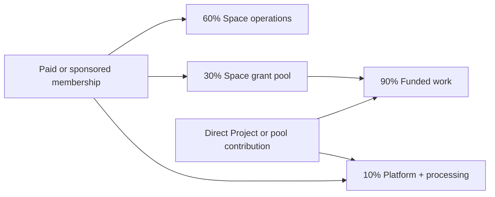

# The Exchange — Discernment Brief

*For conversation and prayer with David, Haley, and creative partners — June 22, 2026*

## Why we are meeting

We are not trying to approve the full vision or settle every feature today. We want to discern which real needs The Exchange should serve first, how to bridge both AP & TAS visions and needs, what language is clear, and what the smallest real tests would teach us.

## The idea in one sentence

**The Exchange helps mission-aligned creative communities gather around meaningful work, sustain participation through paid or sponsored membership, fund creative projects, and share what the community produces.**

Each community defines its own mission and language. One Space might describe creatives as missionaries; another might speak of artists, fellows, or community-serving creatives.

## The two use cases we understand today

### 1. Tables — ongoing creative community

Table Art Society gathers a defined group of creatives for relationship, formation, shared practice, and collaboration over time.

The question is not whether we can reproduce every cohort-management tool. It is which parts of the experience most need a shared home: people, introductions, gatherings, creative work, updates, and stories — and whether that experience is valuable enough for members to pay for it.

### 2. Funded Projects — money supporting creative work

An organization contributes to a fund. Creatives propose work. A trusted operator selects projects, possibly informed by community input. Recipients do the work and share what resulted.

For clarity:

- A **Project** is the work being proposed or completed.
- A **Grant** or **Award** is the money that funds it.
- A **Fellowship** is one kind of award: longer-term or recurring support for a creative and a body of work.

The church supporting a musician is a valuable Fellowship example, but we do not yet know whether patron-to-creative matching is a repeatable primary use case.

### Paid and sponsored membership — the bridge

Membership is part of the core test, not merely a later revenue feature.

- A creative can pay to join a Space or Table because the community itself provides recurring value.
- A church or other patron can sponsor a creative's membership, giving them access without directing their work.
- A patron can later choose to fund a specific Project or Fellowship, but sponsorship does not have to begin there.
- A significant, published portion of every paid or sponsored membership helps fund creative work inside the Space.

This lets us test three different convictions: whether creatives value belonging enough to pay, whether patrons value widening access, and whether participation leads to meaningful creative work.

### Working participatory model

For the pilot, use one transparent allocation for every $100 of paid or sponsored membership:

- **$60 supports Space operations** — leadership, gatherings, formation, curation, and member care.
- **$30 is reserved for the Space's grant pool** — it funds approved creative Projects and cannot quietly become operating revenue.
- **$10 supports the platform and payment processing.**

Membership does not buy an award or guarantee that a member's Project will be selected. It buys participation in a community that collectively helps make funded work possible. A patron who wants nearly all of a contribution to reach funded work can contribute directly to the grant pool instead of sponsoring membership.

### Money flow sanity check

| Payment type | Space operations | Grant pool or funded work | Platform + processing |
|---|---:|---:|---:|
| **Paid or sponsored membership** | $60 | $30 | $10 |
| **Direct Project or pool contribution** | $0 | $90 | $10 |

## What may be shared across both

- A Space with its own mission, identity, and operator
- Creative profiles and relationships
- Paid or sponsored membership in Tables or cohorts where smaller groups gather
- Projects and simple progress updates
- Public stories showing what the community is making and supporting

Everything else should earn its way into the product through actual use.

## The central validation risk

The model needs real financial commitment from both sides:

- **Will creatives pay and renew** because the Table or Space is valuable even if they never receive an award?
- **Will churches and other patrons pay** to sponsor membership or add money directly to Projects and the grant pool?

Encouragement, interest, and verbal support are not enough to answer either question. The pilots need real payments and renewal decisions.

## Questions for today

1. **Membership value and price:** What recurring experience would make a creative willingly pay to belong? At what real pilot price?
2. **Sponsored access:** Why would a church or patron sponsor someone's membership rather than contribute directly to a Project? How should sponsored members be identified or invited?
3. **TAS need:** Which parts of running a paid Table or cohort are essential today, and which existing tools can remain in place?
4. **Participatory funding:** Does the proposed 60/30/10 split feel honest and sustainable? How should the committed $500 per month combine with the membership-funded pool?
5. **Discernment and creative experience:** What should contributing members influence, what remains the operator's responsibility, and how do we prevent membership from feeling like pay-to-play?
6. **First tests:** What is the smallest real paid-membership, sponsored-membership, and Project Award experience we can test, and who will own each one?

## Decisions worth leaving with

- One plain-language purpose for The Exchange
- The essential TAS Table journey
- The first paid-membership offer: for whom, at what pilot price, what it promises, and its published allocation
- The first sponsored-membership offer and a real potential sponsoring organization
- The first funded-Project format and decision process
- One accountable operator for each pilot
- What we will deliberately defer

## Not for today

- Final platform name or complete taxonomy
- Every possible funding type
- Long-term pricing tiers or revenue projections; a real pilot membership price should be chosen
- Full voting mechanics
- National expansion or a large October feature list
- Final legal and tax design; those details should follow the chosen funding model with nonprofit counsel and a CPA

# Meeting notes
2 roles: Project hosts and patrons
by being on the platform, you're supporting local artists
only hosts pay
remove the barriers, so all boats rise
who is our initial core tribe? is the church there?

RICK: email to all
what is the one thing each of us needs to move forward and 
goal for Nov.

# Most important thing for stakeholders
1️⃣ The most important thing the Artist Exchange could do for TAS:
The Artist Exchange would provide a logical progression in our pipeline of engagement, serving as a functional space where artists can access ongoing opportunities, active engagement, and continued connections with resources both inside and outside of TAS. This lowers barriers and facilitates greater participation.
2️⃣ An amazing blessing to see in November:
To see TAS artists actively using and piloting the platform, experiencing its benefits firsthand—sharing user victory stories that highlight their growth and connection through this initiative. 
