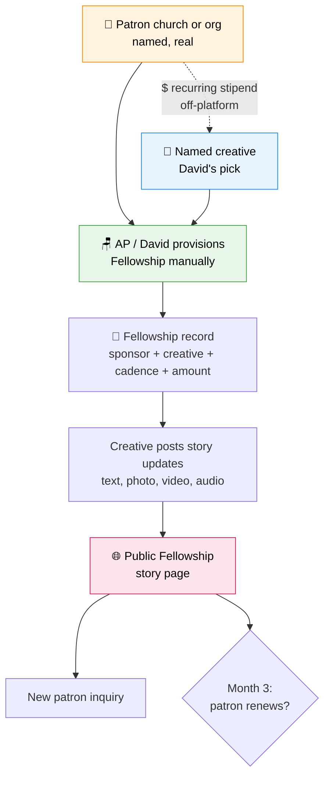
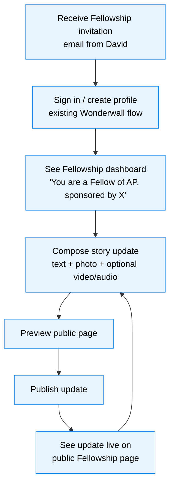
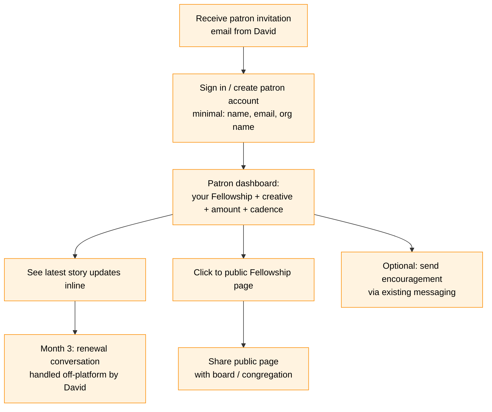
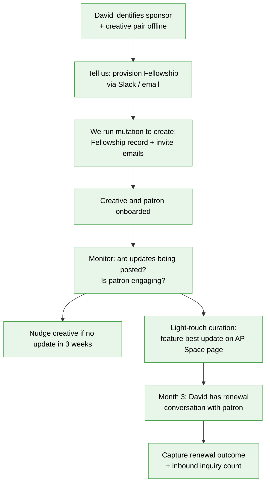
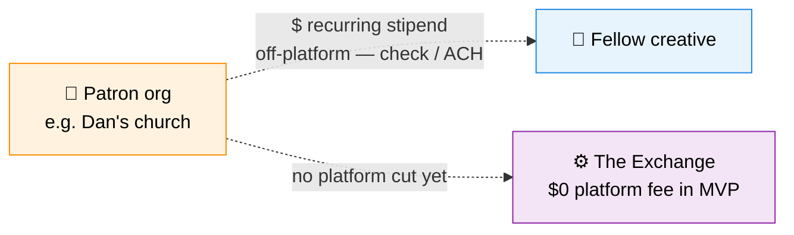
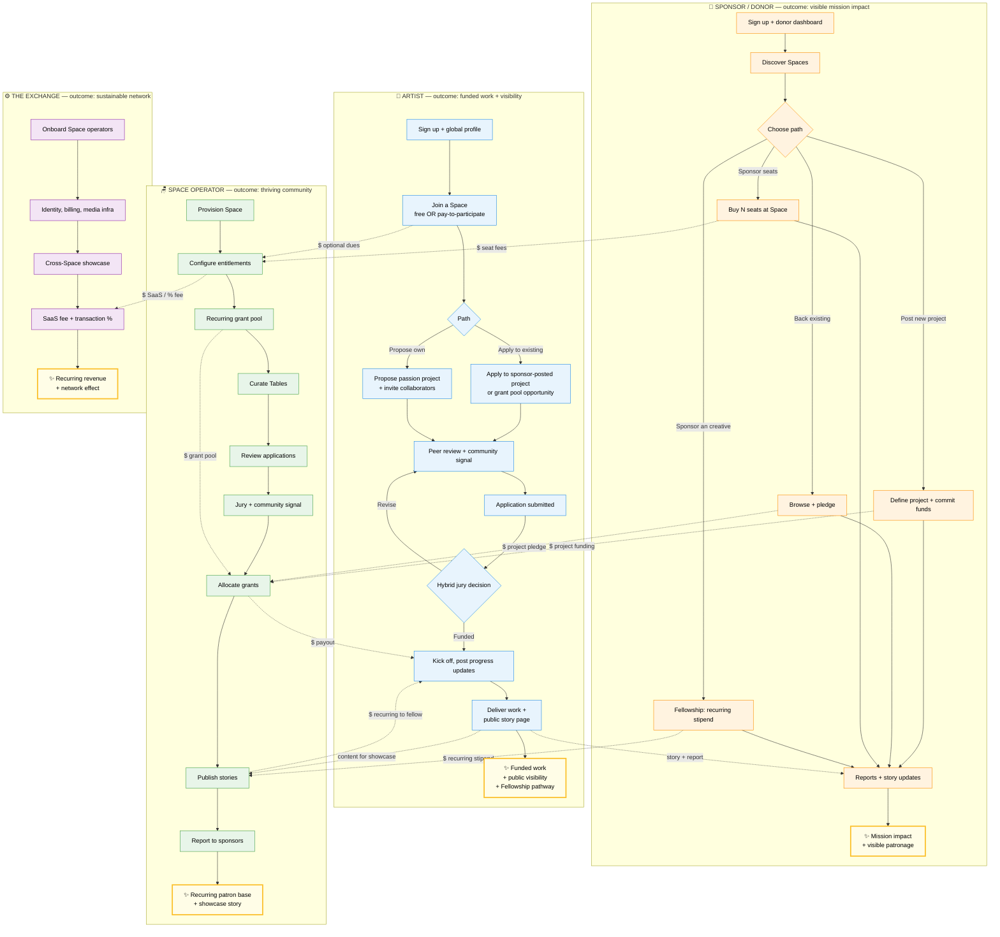
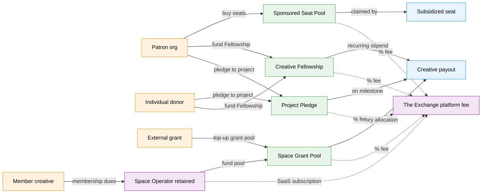

# The Exchange — MVP: Single-Fellowship Validation

> **Status — superseded as the current validation plan (2026-06-22).** Do not implement this scope unchanged. The current direction must also test paid membership, sponsored membership, and a Project Award funded by the membership grant-pool contribution plus direct patron funding. Use the [discernment brief](the-exchange-discernment-brief.md) and [vision v0.9](the-exchange-vision.md) for the next decision; revise this MVP after those tests are chosen.

*Companion to [the-exchange-vision.md](the-exchange-vision.md)*

*Version 0.2 — 2026-06-22 — terminology aligned with vision v0.8+ (Creative, Space); Founding Patron signal check added. Scope itself still awaiting revision per the status note above.*

---

## What this doc is

The smallest possible build of The Exchange that produces real evidence — by October — about whether the **Creative Fellowship + public story page** is the marketing engine we believe it to be.

If this MVP works, everything else in the [full vision](the-exchange-vision.md) earns its build cost. If it doesn't, the full vision is over-investment and we re-scope.

---

## The hypothesis

> **A publicly-visible, ongoing story of one sponsored creative doing creative work in the community — credited to a named patron — will (a) deepen the patron's commitment enough to renew, and (b) attract at least one new inbound patron inquiry.**

This is the single thing the MVP tests. Everything else is supporting infrastructure for that test.

---

## Success metrics (what makes this a "win")

| Metric | Target | Why it matters |
|---|---|---|
| **Patron renews at month 3** | Yes | Validates the model from the sponsor side — they got enough value to keep paying |
| **Inbound patron inquiries attribuspace to the story** | ≥1 | Validates the content loop — the public story actually drives new patrons, not just retains existing ones |
| **Story updates published in 3 months** | ≥3 | Validates the creative's willingness/ability to feed the loop |
| **Story page visitors** | ≥200 unique | Baseline reach signal; tells us if distribution mechanics work at all |
| **At least one secondary "I want this for my church" or "I want to be a Fellow" conversation** | Yes | Soft signal that the model is contagious |

If we hit renew + ≥1 inbound + ≥3 updates, we ship the rest of the vision. If we miss renew, we re-examine the patron value proposition before building anything else.

---

## MVP scope (visual)



Notice what's missing on purpose: no Sponsored Seats UI, no grant pool, no jury, no projects rename, no Tables, no Events, no Pathfinding, no sub-Spaces, no Stripe, no TAS, no second Fellowship. All of that is in the full vision; none of it is in MVP.

---

## What's in / what's out

### In scope

| Surface | Build state | Notes |
|---|---|---|
| `spaces` entity with **AP provisioned** | Schema + seed | Single Space only; multi-tenant abstraction proves itself by being honestly used once |
| **Profile** (existing Wonderwall profile, lightly extended) | Reuse current | Add a per-Space "intro" overlay field — minimum viable identity polish |
| **Fellowship** entity | New | sponsor, creative, cadence, amount, start date, status, public slug |
| **Fellowship story** entity | New | Author, body, mixed media URLs, published timestamp |
| **Story update composer** (creative-facing) | New, simple | Text + image upload + YouTube/Vimeo URL + audio URL; publish toggles public |
| **Public Fellowship story page** | New | The marketing surface; URL like `/ap/fellowships/[slug]`; public-by-default |
| **Patron dashboard view** (minimal) | New, simple | "Your Fellowship: [creative]. Latest updates. Link to public page." That's it. |
| **Manual operator workflow** (David/us) | Convex dashboard | No operator UI built — David tells us, we run mutations |
| **Cross-link from Wonderwall/Crossboard** | Reuse | Existing audience finds Fellowship via existing channels |

### Explicitly out of scope (deferred to post-MVP)

- Sponsored Seats UI and self-serve allocation
- Grant pool, project applications, jury, voting
- Projects rename (Jobs stays "Jobs" in code for now)
- Tables (small groups & cohorts) within a Space
- Events (working meetings, feedback loops, formation)
- Pathfinding (guides directory)
- TAS Space provisioning
- Sub-Spaces for cities
- Cross-Space platform-wide showcase
- Stripe / Cloudflare Stream / LiveKit / Zoom integration
- Multiple Fellowships in parallel
- Per-Space billing configuration
- Self-serve Space operator dashboard
- Pay-to-participate gates
- Native messaging on Fellowship pages (use existing messaging)

If David or Haley pushes for any of the above before October, we explicitly trade against the renewal/inbound metric.

---

## User journeys (MVP)

### 1. Creative (the Fellow)

**Outcome:** Funded creative work + a public body of work that demonstrates what patronage produces.



**Key UX requirements:**
- **One-screen onboarding** for an invited Fellow. Skip anything that isn't profile-essential.
- **Story composer is dead-simple** — single page, no rich-text gymnastics. Title + body + up to 5 media items (image upload, YouTube/Vimeo URL, audio URL, link). Publish or save draft.
- **Frictionless re-entry**: an creative who posts once should be able to post again in under 90 seconds from cold email.
- **Public preview before publish** — they always see what the patron and public will see.
- **No private/public confusion** — every update is published to the public page by default; a "keep this one private" toggle exists but defaults off.

### 2. Patron (the sponsor)

**Outcome:** Visible, ongoing proof that their money is producing creative-missionary work in the community — the kind of thing they can show their board, their congregation, or their next donor.



**Key UX requirements:**
- **Patron account is minimal** — no portfolio, no skills, no bio required. Name + email + org affiliation. They're not building a profile; they're tracking a relationship.
- **Patron dashboard fits in one viewport**: Fellowship summary card → recent story updates → "View public page" button → "Send encouragement" button. That's it.
- **The public page IS the share artifact** — patron should be able to grab a clean URL and screenshot-worthy view to send to their congregation. The page should look polished even with one story update.
- **Patron credit is prominent but tasteful** — opt-in default-on for visible credit; opt-in for logo placement. Style with the Anthropic-brand-quality care you'd give a real publication.
- **No checkout flow in MVP** — money moves off-platform (check, ACH, whatever David and the patron already do). We just record the commitment.

### 3. Space Operator (David / us, manually)

**Outcome:** Run the Fellowship cleanly enough that the creative and patron both feel taken care of, and capture enough story output to make the case for the next Fellowship.



**Key UX requirements (for *us*, since the operator surface is manual):**
- **No operator UI built**. David tells us via Slack / Granola notes; we run Convex mutations. This is fine for one Fellowship and forces us to feel the operator pain before designing for it.
- **Internal runbook**: a short checklist for provisioning a Fellowship — schema fields needed, invite email template, monitoring cadence.
- **Engagement telemetry on us**: we set up basic page-view analytics, story-update counts, and a weekly "Fellowship health" check so David doesn't have to ask.
- **Nudge ourselves to nudge David** — calendar-driven, not vibe-driven. Week 4, week 8, week 12 check-ins.
- **Founding Patron signal check** — at week 6 and week 12, explicitly ask David whether the patron is showing institutional-scale interest (a $10k+/yr Founding Patron relationship). If yes, the MVP is also prototyping the platform's most important Year-1 revenue line.

---

## Financial mechanics (MVP)

### MVP money flow



**MVP financial design choices:**
- **Money moves off-platform.** We're not handling payments in MVP. Patron pays creative directly (check, ACH, Venmo, however they prefer). We record the commitment in the Fellowship record but don't process the transaction.
- **No platform fee in MVP.** We forgo revenue to remove all friction. The validation question is whether the *model* works, not whether the *platform can take a cut*. We add the platform cut after the model is validated.
- **Cadence and amount are configurable per Fellowship.** Whatever David and the patron agree to — monthly, quarterly, lump sum + monthly check-ins. Schema supports any of these.
- **Fulfillment tracking is optional in MVP.** We can record "paid in month 1" as a manual checkbox if it's useful, but we don't enforce it.

For the full set of financial mechanisms the platform will eventually support, see [the full money-flow diagram in the vision doc](#full-vision-money-flow-for-reference) (also reproduced in the appendix below).

---

## Minimum data model

```typescript
// New
spaces: {
  slug: string,                // "ap"
  name: string,                // "Abiding Practice"
  brand: { logoUrl?, primaryColor?, intro? },
  operatorUserId: Id<"users">, // David
  status: "active" | "draft",
  createdAt: number,
}

spaceMemberships: {
  spaceId: Id<"spaces">,
  userId: Id<"users">,
  role: "member" | "fellow" | "patron" | "operator",
  introOverlay?: string,       // Space-specific intro emphasis
  joinedAt: number,
}

fellowships: {
  spaceId: Id<"spaces">,
  creativeUserId: Id<"users">,
  patronUserId: Id<"users">,   // the contact at the patron org
  patronOrgName: string,       // displayed publicly
  patronOrgLogoUrl?: string,
  cadence: "monthly" | "quarterly" | "one_time",
  amountCents: number,
  startDate: number,
  status: "active" | "paused" | "ended" | "renewed",
  publicSlug: string,          // for /ap/fellowships/[slug]
  publicVisibility: "public" | "members_only", // default public
  patronCreditVisible: boolean, // default true
  createdAt: number,
  endedAt?: number,
}

fellowshipStories: {
  fellowshipId: Id<"fellowships">,
  authorUserId: Id<"users">,   // typically the Fellow
  title?: string,
  body: string,                // markdown
  media: Array<{ kind: "image" | "video_url" | "audio_url" | "link", url: string, caption?: string }>,
  publishedAt?: number,        // null = draft
  isPublic: boolean,           // default true
  createdAt: number,
  updatedAt: number,
}
```

**Notes:**
- We're reusing existing `users` and `profiles` spaces — no changes needed.
- `spaceMemberships.role: "fellow" | "patron"` is the entitlement signal in MVP; full capability-based entitlements ([entitlements-paywall-foundation.md](features/entitlements-paywall-foundation.md)) come later.
- No `organizations` space — `patronOrgName` is a string in MVP. We promote to a real org record when we have more than one Fellowship from the same patron.

---

## Surfaces & routes (MVP-only)

| Route | Audience | Purpose |
|---|---|---|
| `/ap` | Public | AP Space landing — describes the Space, lists Fellowships, has "Become a patron" CTA |
| `/ap/fellowships/[slug]` | Public | The Fellowship story page — patron credit, creative intro, reverse-chronological story updates |
| `/dashboard/fellow` | Fellow (creative) | Story composer + list of past updates |
| `/dashboard/patron` | Patron | Fellowship summary + latest updates + share button |
| `/dashboard/operator` *(deferred)* | David | Not built — David uses Slack to talk to us |

**Public page styling notes:**
- Treat the public Fellowship page as the design centerpiece. It is the artifact that does the marketing. Every other screen can be utilitarian; this one should be beautiful.
- Mixed-media story updates should feel editorial, not feed-y. Think "longform with photos," not "Instagram grid."
- Patron credit appears in a dedicated "Supported by" section, with logo if provided, and a "Become a patron" CTA that goes to a contact form for David (not self-serve checkout).
- Mobile-first; share-card metadata (OG tags) are non-negotiable since the patron will share this externally.

---

## Manual operations (what's done by hand vs. built)

| Task | Built | Manual (us + David) |
|---|---|---|
| Provision Fellowship | mutation exists | David tells us via Slack; we run it |
| Invite creative and patron | invite email template | We send the email manually |
| Money transfer | – | Entirely off-platform |
| Renewal conversation | – | David handles, tells us outcome |
| Featuring a story update on AP landing | "featured" boolean on story | David tells us which one; we toggle |
| Attribution tracking for inbound inquiries | contact form on public page | We tag and report manually |
| Analytics review | basic page-view counter | We do weekly check-ins |

**This is intentional.** Building operator UI before we know if the model works is the most common way pre-validation products waste time. We feel the operator pain by being the operator.

---

## Timeline to October showcase

Assuming a typical 1–2 dev capacity and that October showcase is the deadline:

| When | Milestone |
|---|---|
| Now → +2 weeks | Schema + mutations for Spaces, SpaceMemberships, Fellowships, FellowshipStories. Seed AP Space. |
| +2 → +4 weeks | Public Fellowship story page (the design centerpiece). Public AP Space landing page. |
| +4 → +5 weeks | Fellow dashboard + story composer. Onboarding flow for invited creatives. |
| +5 → +6 weeks | Patron dashboard (minimal). Patron onboarding flow. Share-card metadata. |
| +6 weeks | Provision the real first Fellowship. David + the named patron + the named creative. Go live. |
| +6 → October | Story updates accrue; we monitor; David has renewal conversation; we measure metrics. |
| October | Showcase uses the live Fellowship as its centerpiece. |

Risk if any phase slips: cut the patron dashboard first (patron can use the public page + email). Cut Space landing page second (Fellowship page can stand alone). Don't cut the public Fellowship page or the story composer — those are the test.

---

## What we learn either way

| Outcome | What we do next |
|---|---|
| **Win** (renew + ≥1 inbound + ≥3 updates) | Ship the rest of the vision: Sponsored Seats, Grant Pool, second Fellowship, TAS Space, Stripe |
| **Partial** (renew but no inbound) | Story page works for retention but not for acquisition. Investigate distribution: is the showcase visible enough? Are share mechanics good enough? Iterate on the public page before expanding |
| **Partial** (inbound but no renew) | Story page works for acquisition but patron value isn't strong enough. Investigate: was the creative's output what the patron expected? Was the patron getting enough proof? Iterate on patron experience |
| **Miss** (no renew, no inbound) | The Fellowship-with-public-story is not the engine. Reconsider before building more. Could mean: wrong creative/patron pair, wrong story format, wrong audience, wrong model. Talk to David before re-scoping |

---

## Open questions for David before we start building

These need answers before Phase 1:

1. **Who's the first Fellow?** A specific named creative David is ready to commit to.
2. **Who's the first patron?** A specific named org/individual ready to commit funds for 3+ months. (Dan's church sounds like the candidate.)
3. **What's the stipend amount and cadence?** Drives the Fellowship record and the renewal math.
4. **How prominent should patron credit be?** Default-prominent in MVP, but confirm tone with David and the patron.
5. **Where does the showcase event live physically?** Affects whether we need an event-page component or just the public Fellowship page.
6. **What inbound channel do we instrument?** Contact form on public page → Slack notification → David? Email?

---

## Appendix: full vision diagrams (for reference)

The MVP is a deliberate subset of the full vision. These diagrams (from [the-exchange-vision.md](the-exchange-vision.md)) show where MVP fits and what gets added after.

### Full user-flow + money-flow diagram



In MVP terms: we are building **only** the right-hand "Sponsor an creative" branch (S7), the creative's "post story update" leg (A9 → A10), the Space operator's "publish stories" step (T8), and the public showcase surface. Everything else is in the diagram so we don't forget it exists.

### Full vision money flow (for reference)



In MVP terms: we are only exercising the **FELLOW** path from SP1 → FELLOW → ART, and we're forgoing the platform fee. Everything else is post-MVP.

---

*Next steps: confirm the open questions with David, lock in the first Fellow + first patron, start Phase 1 schema work.*
