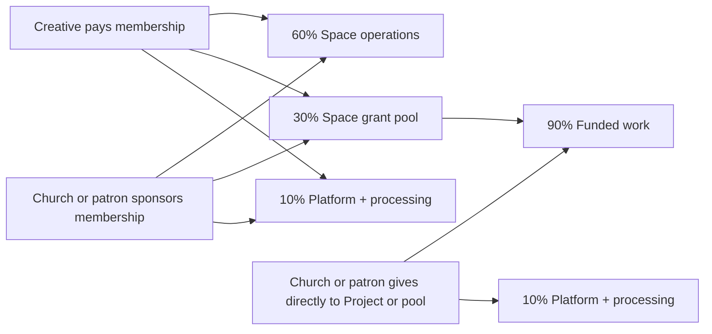

# The Exchange — Stakeholder One-Pager

*For David, Haley, artists, and early patrons*

## Elevator pitch

**The Exchange helps mission-aligned creative communities run paid or sponsored membership, gather people in Tables, and fund creative Projects through a mix of member participation and patron support.**

## What it is

- A **Space** is a community like AP or TAS with its own mission and operator.
- A **Table** is a smaller group inside that Space for formation, practice, collaboration, or cohorts.
- A **Project** is the creative work being proposed or completed.
- A **Grant** or **Award** is the money that funds the Project.
- A **Fellowship** is one kind of Project funding, usually longer-term or recurring.

## The two use cases to validate first

1. **Tables**: people pay or are sponsored to belong to a creative community that is valuable on its own.
2. **Funded Projects**: patrons and the community help fund selected creative work.

## Why membership matters

- Membership is not just access. It is part of the funding model.
- Creatives can pay to belong because the Table or Space gives them recurring value.
- Churches or patrons can sponsor membership when they want to widen access without directing the work.
- A published portion of every membership helps fund creative Projects inside that Space.

## Money flow sanity check

### Simple rule

| Payment type | Space operations | Grant pool or funded work | Platform + processing |
|---|---:|---:|---:|
| **Paid or sponsored membership** | $60 | $30 | $10 |
| **Direct Project or pool contribution** | $0 | $90 | $10 |

### What that means

- Membership supports both the community and the creative work.
- Direct Project or pool contributions are for patrons who want nearly all money to reach funded work.
- Membership does **not** buy an award or guarantee selection.

### Visual flow

## The real risk

- **Will creatives actually pay and renew** for the Table or Space even if they never receive an award?
- **Will churches or patrons actually sponsor memberships or fund Projects** with real money, not just encouragement?

If the answer to either is no, the model weakens fast.

## What we need to decide now

1. The first paid membership offer: who it is for, what it includes, and the pilot price.
2. Whether sponsored membership is a real offer we believe patrons will choose.
3. The first funded Project format and how decisions are made.
4. The smallest real pilot that tests payments, sponsorship, and one funded Project.
