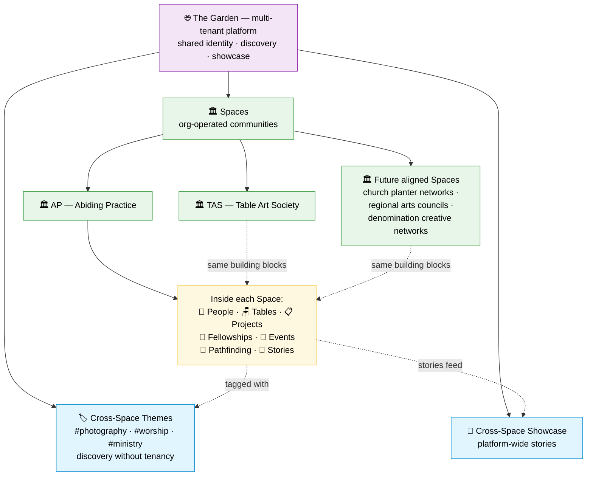
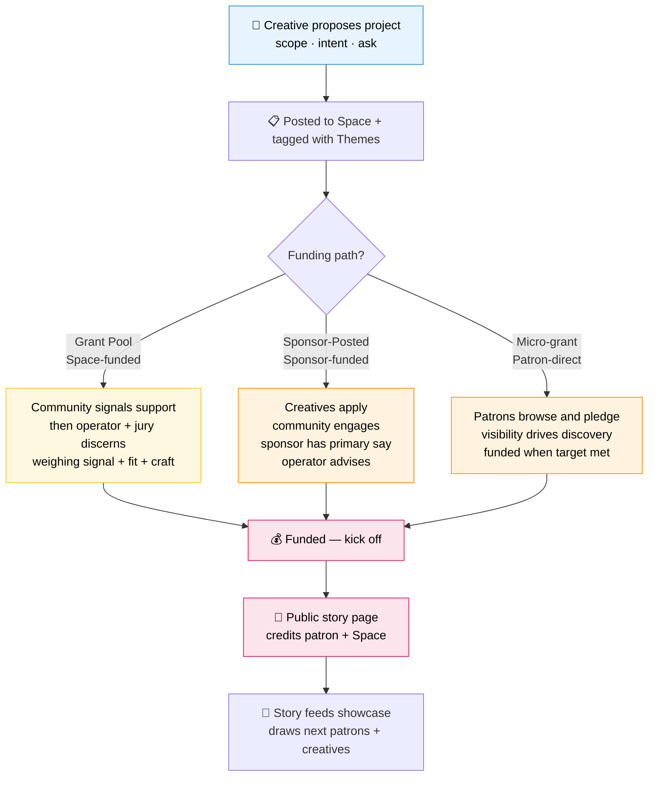
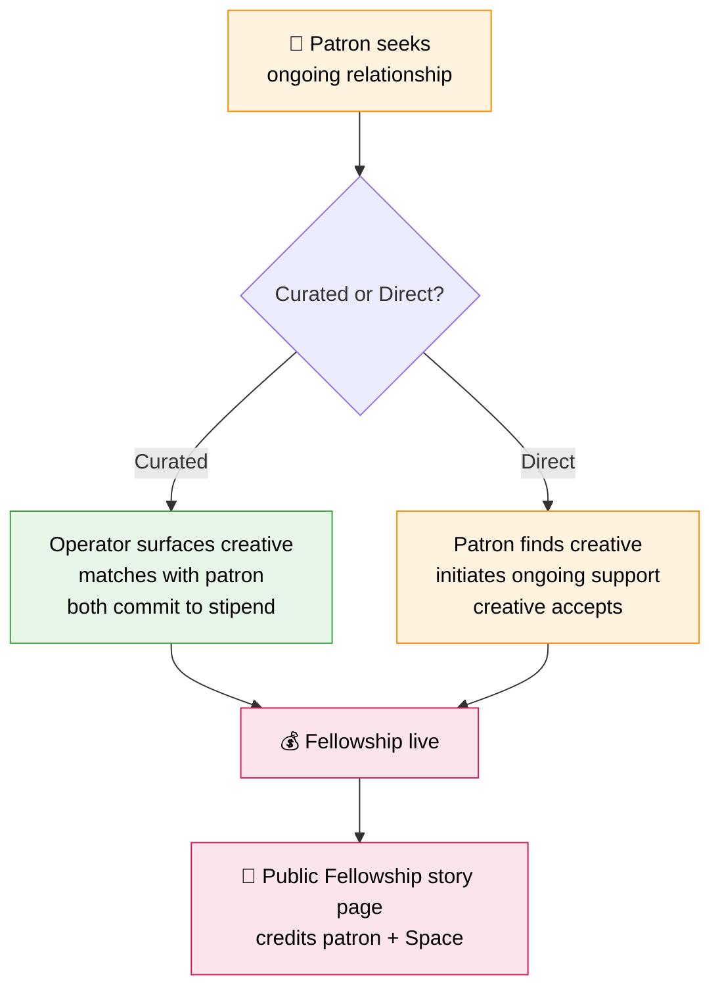
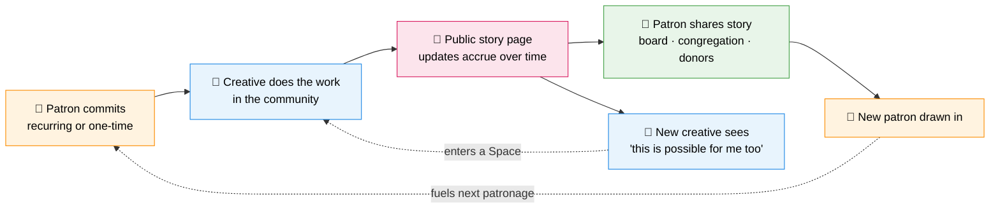
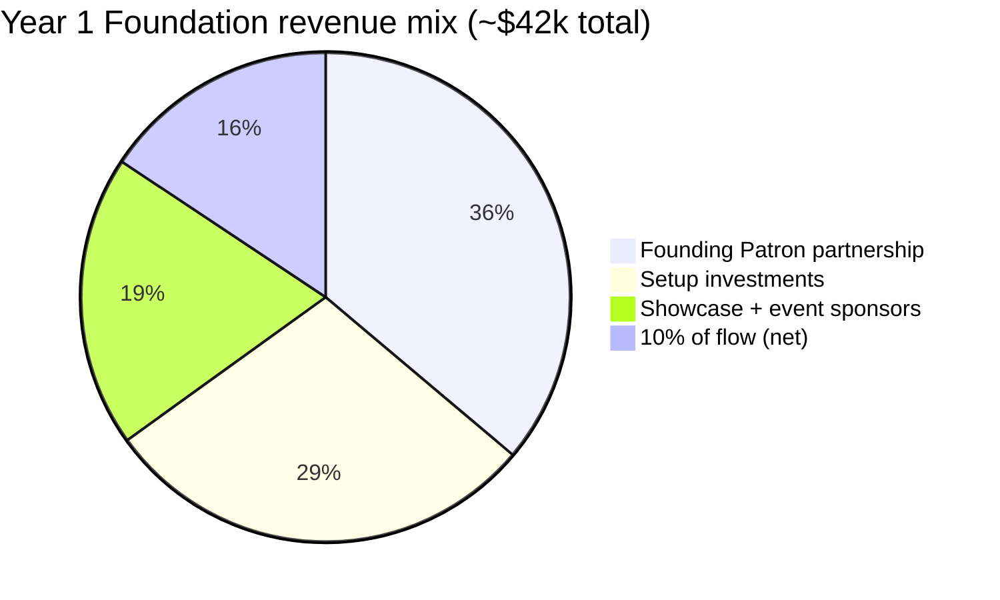

# The Exchange — Vision

*A platform for mission-aligned creative communities. Draft for review by David Russo (Abiding Practice) and Haley (Table Art Society).*

*Version 0.8 — 2026-06-20 — revenue model radically simplified to "10% of everything" headline + setup investment + Founding Patron partnerships (no tiered subscriptions, no Bronze/Silver/Gold packages); added explicit "why we charge what we charge" framing for faith-aligned audiences; removed Monday-as-deadline framing from Part 9 conversations*

---

## TL;DR

The Exchange is a platform that lets mission-aligned organizations run their own creative communities — called **Spaces**. Inside a Space, creatives do work, patrons fund work, the community surrounds it, and the Space operator (the host org) shapes the discernment that turns proposals into funded projects.

Two things make it specific: **creatives are treated as missionaries, not employees** (sponsorship frees them to do work in the community, not for the sponsor); and **funding decisions are layered** — community signal informs, the Space operator discerns, and the primary sponsor (when there is one) has the deciding voice.

We launch with Kingdom-minded Spaces (Abiding Practice, Table Art Society). The platform itself is mission-neutral so it can host other aligned communities later. The October 2026 showcase is the forcing function.

---

## What changed in this revision

For David's quick read — the questions you raised on v0.2 are addressed here:

| Your question / comment | What changed |
|---|---|
| "Artist" sounds like painter/musician only — use "Creative" | Renamed throughout. "Creative" = any maker (designer, writer, musician, filmmaker, photographer, etc.) |
| Patron framing was too binary ("back a person, not a cause") | Reframed as additive optionality — patrons get to choose person *or* initiative *or* the community itself |
| Terminology confusion: Tables = community? Or smaller group inside? | **New taxonomy** (see Part 3): Exchange → Spaces (org tenancy) → Tables (smaller intimate groups) → Themes (cross-Space hashtags). "Seat at the table" stays intact at the Tables level |
| Fellowship vs micro-grant — same thing? | **Split into four patronage shapes** (see Part 2): Sustaining Member, Project Pledge / Micro-grant, Sponsored Seat, Fellowship. Fellowship is the substantial ongoing one; micro-grants are the small accessible ones |
| Fellowship — curated or self-directed? | **Both.** Curated Fellowship (operator-matched) and Direct Fellowship (patron-initiated, GoFundMe-style) are both supported |
| Kingdom-minded vs broader? | Platform is mission-neutral; launch Spaces are Kingdom-minded. AP and TAS define their own faith framing inside their Spaces. Future Spaces could be a secular arts council without forcing the platform to change |
| "Medieval patronage" analogy too vague | Grounded better — closer to modern artist residencies, NPR/KLOVE sustaining membership, and Patreon ongoing support than to Medici specifically |
| Crossboard's fate? | **Sunsetting into AP's Space at launch.** The Exchange is the platform; Crossboard's audience becomes one of AP's first member cohorts |
| 5 hours/week operator load is arbitrary | Acknowledged. We'll measure David's actual time over the first Fellowship and let that calibrate, not assume |
| October showcase format? | In-person at La Paloma (or larger), ticketed to support the arts, free livestream. Pre-event targets: >$10k secured sponsorships, >50 patrons committed. Impact moment: "real money + real people — worth $5–$20/mo to join" |
| Need pricing study on willingness-to-pay | Added as a research item — compare to KLOVE/AIR1/KPBS sustaining members, World Vision/Compassion International ($39–$43/mo), Patreon tiers ($5/$10/$20) |
| Need market validation for the platform model | Added as a research item — outreach to community organizers on Substack, Skool, and physical church/arts communities |

---

## Part 1 — Who's here, and what they want

Five kinds of people use The Exchange. Their wants, their moments of value, and what we're *assuming* about them.

### The Creative

> *"I want to do work that matters, with people who take my craft seriously, and I want to be supported in a way that lets me do it as a calling — not just as a gig."*

Anyone who makes — designer, writer, musician, filmmaker, photographer, illustrator, worship leader, ceramicist. "Creative" is broader than "artist" on purpose.

**What they want:**
- A community of peers and heroes who take their craft seriously
- A way to propose work they care about and see if others want to back it
- Patronage that frees them, not patronage that owns them
- Visible proof that their work is producing something — so they keep getting backed
- A path from small project funding to ongoing support as their work matures

**Moment of value:** Posting a story update about real creative-missionary work in the world, knowing both their patron and a public audience will see it.

**What we're assuming (needs validation):**
- That creatives want ongoing patronage in addition to (not instead of) one-off gigs
- That creatives are willing to share publicly — even when the work is personal or formative
- That a small fee to participate in a Space feels like commitment, not a tax — and that they value some of their fee supporting other creatives' grants
- That creatives will keep posting story updates over months without heavy prompting

### The Patron

> *"I want my giving to produce something I can point to. Sometimes I want to back a specific person. Sometimes I want to back a specific initiative. Sometimes I want to sustain a whole community. I want the choice."*

**What they want:**
- Support specific creative people **and** specific initiatives **and** the community itself — the platform offers all three, not a forced binary
- See ongoing, visible proof of impact (stories, photos, places, encounters)
- Be credited as a patron — tastefully, in the open — so other patrons see the model
- Avoid putting the creative on payroll; the goal is freedom, not employment
- Lower-friction ways to give a little, and structured ways to give a lot

**Moment of value:** Forwarding a public story page (Fellowship, project, or community update) to their board, congregation, or fellow donor — and having it land as evidence of real work being done.

**What we're assuming (needs validation):**
- That patrons want public credit by default (we've defaulted to public — confirm with the first patron; allow private as an opt-in)
- That patrons will renew based on story output (vs. expecting attendance numbers, conversion metrics, ROI)
- That patrons want both recurring and one-time options (different moments call for different commitments)
- That patrons trust a Space operator to vet creatives by default — while preserving the option for the patron to do their own diligence and direct the relationship themselves

### The Space Operator (David, Haley)

> *"I want to lead a real creative community without building software. I want our patronage to be participatory but discerning — community voice matters, but I'm not handing the keys to a popularity contest. And I want this to be a sustainable way to fund the work we care about, outside the unsustainable cycles of social media and fundraising."*

**What they want:**
- Gather the right people around a shared mission
- Run a small recurring patronage pool that funds genuinely resonant work
- Weigh community input without abdicating final discernment
- Match the right sponsor to the right creative for Fellowships
- Public stories that draw the next round of patrons and creatives in
- A sustainable operating cadence — daily for them, not a side project

**Moment of value:** Standing in front of a sponsor (or a room of them) at the October showcase and pointing to *real* funded creative work that came out of this community.

**What we're assuming (needs validation):**
- That David and Haley want a participatory model and not pure top-down curation
- That community voting/signal will actually happen at meaningful volume (not become a ghost feature)
- That operator load is sustainable — we'll measure rather than assume a number, and the design changes if it isn't
- That David and Haley want similar enough things that one platform serves both — including their expansion goals (international federation of their Spaces)
- **That a market exists beyond these two.** Other community organizers (on Substack, Skool, or in physical church/arts communities) need to want this model too. **Validation requires outreach research before scaling.**

### The Community Member

> *"I'm here because this is my people. I want to see what others are making, support what resonates with me, and find collaborators for my own work."*

**What they want:**
- See what fellow members are proposing and doing
- Have a voice in what their community funds
- Find collaborators for their own work
- Belong to a place that feels coherent and not noisy

**Moment of value:** Seeing a project they championed actually get funded — feeling that their voice mattered.

**What we're assuming (needs validation):**
- That members will participate in signal/voting at meaningful rates
- That members want to back peers (vs. just consume content)
- That cross-Space participation works — a member of AP can comfortably also be a member of TAS without confusion

### The Platform Operator (Rick)

> *"I want to give mission-aligned leaders — starting with Kingdom-minded ones — the leverage to do their work in financially and personally sustainable ways. I'm not building community from scratch; I'm building the place where communities like Abiding Practice and Table Art Society can thrive, and where the platform itself becomes self-sustaining and can be run by others."*

**What they want:**
- A platform that serves the mission of community patronage and creative fellowship
- A platform that can be operated by others (both backend ops and frontend community leadership)
- A platform that becomes self-sustaining through Space operator subscriptions and transaction fees — not dependent on Rick's full-time attention
- A clear path to step back and let others lead while the mission continues

**On faith framing:** The platform is intentionally mission-neutral so it can host any aligned creative community. Launch customers (AP, TAS) are Kingdom-minded and define their own faith framing inside their Spaces. The platform doesn't gate or police theology; Spaces do. This lets us start with focus and credibility without closing future doors.

**Moment of value:**
- When patrons pledge and sponsors fund projects without Rick personally needing to be in the loop
- When members and creatives join at a paid tier, apply for projects, and post their own passion projects
- When the platform's recurring revenue covers operating costs and proves the model

**What we're assuming (needs validation):**
- That Rick can build a platform that runs without him at the center
- That MVP ships in time for October 2026 — narrow scope, real launch
- That Space operator communities can generate enough membership + patron revenue to fund operations (target TBD — pricing study needed)
- That some patrons will back multiple creatives or projects (driving lifetime value)
- That some creatives will pay more than the base tier (Pro/Patron/Founding contributions to the grant pool)
- That the Fellowship pattern works both with operator matching AND through direct patron-initiated funding
- That the platform can carry multiple funding paths and relationships while staying simple enough for patrons to understand

---

## Part 2 — The dynamics

How these humans interact. Four dynamics shape the platform.

### Dynamic 1: Patronage takes four shapes, not one

A patron doesn't buy services. Depending on the giver's commitment, intent, and relationship, patronage shows up in one of four shapes. The platform supports all four; each Space can enable any subset.

| Shape | Commitment | Recipient | Relationship | Comparable to |
|---|---|---|---|---|
| **Sustaining Member** | Small recurring (e.g., $5–$25/mo) | The Space itself (operator decides allocation) | Light, fan-like | KLOVE / AIR1 / KPBS sustaining members |
| **Project Pledge / Micro-grant** | Small one-time ($25–$500) | A specific project | Episodic, self-directed | Kickstarter / GoFundMe with a mission filter |
| **Sponsored Seat** | One-time gift ($50–$500) | Another creative's access to the Space | Indirect, generous | Buying a conference ticket for someone |
| **Fellowship** | Substantial recurring ($500+/mo over months) | A specific named creative for outward-facing work | Deep, ongoing, public | Modern artist residencies, ongoing Patreon support, NPR-style major-donor sustaining |

**Two flavors of Fellowship:**

- **Curated Fellowship** — Space operator identifies a creative worth backing, matches with a patron who shares the vision. Higher trust, higher commitment, more discernment. AP's first Fellowship should be this kind.
- **Direct Fellowship** — A patron finds a creative they want to back and initiates ongoing support directly. Operator doesn't need to be in the loop. The platform becomes the publishing surface for the creative's story; the patron gets credit and updates. Closer to Patreon-with-mission.

**Why both:** Curated Fellowships build the platform's credibility (real matching, real discernment). Direct Fellowships create reach (any creative on the platform can be supported by anyone, lower friction). Both feed the same public story surface.

### Dynamic 2: Layered discernment for funding

Where the money decides what gets funded — and the layered authority that keeps it from being either tyranny or popularity contest.

**Three paths to funding a project:**

1. **Space Grant Pool path** (Space-funded; e.g., AP's $500/month recurring pool):
   - Creative proposes → community signals support (upvotes, comments, "count me in") → Space operator + optional jury discerns (weighing signal + mission fit + craft quality) → Award or decline with feedback
   - **Community informs; operator decides.** Not pure vote; not pure curation.

2. **Sponsor-Posted Project path** (sponsor brings the brief and the money):
   - Sponsor posts a project ("we'd like to fund a mural for this neighborhood") → creatives apply → community engages (optional signal) → **Sponsor has primary say**, Space operator advises and ensures fit → Award
   - The sponsor is the patron; the operator stewards the process.

3. **Micro-grant / Direct Pledge path** (patron picks a posted project):
   - Creative posts a passion project (with funding target) → patrons browse and pledge directly → when target is met (or partial-fund threshold reached), the project is funded → public story page begins
   - **Patron decides directly; community visibility helps discovery.** No operator gatekeeping; closer to a curated Kickstarter inside a mission-aligned Space.

**Two paths to a Fellowship:**

4. **Curated Fellowship match** — Operator identifies creative + matches with patron. Operator-driven.
5. **Direct Fellowship initiation** — Patron finds creative on the platform, commits to ongoing support directly. Patron-driven; operator informed but not gating.

**Why this layered design:** Each path preserves a different source of authority. Pure community vote risks popularity-contest dynamics. Pure operator curation risks ignoring the community. Pure sponsor say risks the platform becoming an off-platform hiring channel. Direct patron pledging risks misaligned work getting funded. The mix gives every patron type a way in.

### Dynamic 3: Community happens around the work, at three scales

Spaces aren't general-purpose chat communities. They're built around making things together. The supporting structure operates at three scales:

- **Space-wide** — the whole community of AP, TAS, etc. Where the brand, mission, grant pool, and showcase live.
- **Tables** — smaller intimate groups inside a Space. Can be **Open Tables** (ongoing niche groups: Photographers, Worship Leaders) or **Cohort Tables** (fixed-membership, time-bound — like TAS's 9-month cohorts of 10 people). This is where "seat at the table" stays literal — closer relationships, shared craft, smaller scale.
- **Themes** — cross-Space hashtags (#photography, #worship, #ministry, #filmmaking). Discovery layer that lets a creative in AP see what a creative in TAS is making, without forcing them into the same Space.

Plus two supporting structures:

- **Events** — scheduled gatherings inside a Space or Table. Working meetings, formation prompts, feedback sessions, showcases, livestreams. (Formerly called "Practice" — renamed to be clearer about what it is.)
- **Pathfinding** — mentor/guide relationships within or across Spaces. Where creatives get unstuck.

These exist to make Projects and Fellowships better — not as standalone features.

### Dynamic 4: Stories travel; that's the marketing engine

The public story of a funded project or a Fellowship is the platform's growth mechanism. Each story:
- Shows a current patron what their support produced (drives renewal)
- Shows a prospective patron what patronage looks like (drives acquisition)
- Shows a prospective creative what's possible here (drives supply)
- Shows the broader community that this thing is real (drives credibility)

The October showcase is the first deliberate use of this loop. Pivoting from "creatives on stage" to "creatives embedded in the community" *is* the story. Neighborhood church's support for Shua the musician — where the church funds Shua's music practice and Shua creates work that lives in the broader community — is the prototypical example.

---

## Part 3 — The platform, visualized

### Terminology recap (what each word means)

| Term | Meaning | Example |
|---|---|---|
| **The Exchange** | The platform itself | thexchange.app (placeholder URL) |
| **Space** | An organization's tenancy on the platform | AP's Space, TAS's Space |
| **Space Operator** | The org/leader running a Space | David runs AP's Space; Haley runs TAS's Space |
| **Table** | A smaller intimate group inside a Space | The Photographers Table; TAS's 2026 Spring Cohort |
| **Open Table** | Ongoing topic/niche Table, anyone in the Space can join | Photographers Table, Worship Leaders Table |
| **Cohort Table** | Fixed-membership, time-bound Table | TAS's 9-month cohort of 10 people |
| **Theme** | Cross-Space hashtag for topical discovery | #photography, #worship, #filmmaking |
| **Project** | A piece of creative work, proposed or sponsor-posted, possibly funded | "Mural for the 12 South neighborhood" |
| **Fellowship** | Ongoing patron-creative relationship with public story | Dan's church supporting Shua's music |
| **Event** | Scheduled gathering inside a Space or Table | Monthly Worship Leaders Practice; AP Showcase |
| **Pathfinding** | Mentor/guide relationships | Senior filmmaker mentoring an emerging one |
| **Story** | Public-facing narrative artifact for a Fellowship or funded Project | Shua's ongoing public Fellowship page |
| **Showcase** | The platform's cross-Space surfacing of the best stories | The Exchange homepage stories carousel |

### What's inside a Space (the hierarchy)

**Human-readable observations:**

- **Each Space is a configurable mix of the same building blocks.** AP emphasizes Fellowships, Projects, and the grant pool. TAS emphasizes Cohort Tables and project collaboration. Operators turn on what fits their community.
- **Tables live inside Spaces; Themes cross all Spaces.** A creative could be in the Photographers Table inside AP, and their work could be tagged #photography so a TAS creative or a non-member visitor can discover it.
- **Cities are sub-Spaces.** AP Nashville is a Space inside AP, inheriting brand and policy with its own local people and stories.
- **People are members of Spaces, not the platform.** A person can be a member of multiple Spaces; their identity follows them; their membership and roles live at the Space.
- **Where do proposals get posted?** Default: into a Space (because that's where funding lives). Optionally tagged with Themes for cross-Space discovery. Money is scoped to Spaces; discovery is scoped to Themes.

**Open terminology decisions for David / Haley:**

- **Platform name:** "The Exchange" is the working name. **"The Garden"** (Haley's suggestion) is on the table too — it carries strong associative power (Eden = creation; Gethsemane = formation; trees bearing fruit = work and outcomes; gardener = operator/patron; seeds = proposals; seasons = cycles). If we go with The Garden, the rest of the taxonomy could stay (Spaces, Tables, etc.) or extend the metaphor (Gardens, Plots, Beds). Worth noodling.
- **Org tenancy name:** "Space" is a placeholder. Other options: **Room** (cozier), **Hall** (more guild-like), **Community** (natural but overused in software), or stay with **Space**. Recommendation: **Space** until David and Haley have a stronger pull.
- **"Table" as smaller intimate unit, not whole community:** David's original framing made "Table" mean the whole community. We're proposing Tables as the smaller intimate units (with Spaces as the larger tenancy). David's call — but the TAS cohort use case is what makes this resolution helpful.

### How a proposal becomes funded (the discernment flow)

Five funding paths, three layers of authority, one unified story output.

**A. Project funding paths (3 ways money meets a proposal):**

**B. Fellowship paths (2 ways patrons start ongoing relationships):**

**The discernment is layered on purpose:**

- **Community signal informs but doesn't decide** in the Grant Pool path. Avoids popularity-contest failure mode while still making members feel heard.
- **Sponsor has primary say** in the Sponsor-Posted path because the money has an intent attached. Operator's job is to advocate for fit, not override.
- **Patron decides directly** in the Micro-grant path. Visibility is platform's contribution; the discernment is the patron's.
- **Fellowship Curated is operator-led**; **Fellowship Direct is patron-led**. Same outcome (ongoing patron-creative relationship); different initiating party.

**Open design questions inside this flow** (for David's and Haley's input):

- Are community signals public counts, private to the operator, or threshold-gated ("when 20 members back it, it surfaces to the jury")?
- Is the jury just the operator, the operator + 1–2 invited members, or rotating?
- What's the appeal process when a proposal is declined?
- When a sponsor and operator disagree on a Sponsor-Posted award, who wins?
- Can a Fellowship come *out* of a successful Grant Pool project ("you delivered something amazing; we want to back you ongoing")?
- For Direct Fellowships, does the Space operator have any visibility/right-of-refusal, or is it fully patron-creative?
- For Micro-grants, is there a minimum threshold (e.g., 50% of target) before funds release?

### How patronage produces growth (the story loop)

The story is the marketing engine. It's also the patron's renewal artifact and the next creative's invitation. If this loop closes — even once, with one Fellowship — the whole model has evidence. That's exactly what the MVP tests.

---

## Part 4 — What we're assuming, and what we don't know

### Assumptions about humans (need validation by talking to them or shipping)

| Assumption | If wrong, what changes |
|---|---|
| Creatives want ongoing patronage in addition to one-off gigs | Fellowship model isn't the centerpiece; lean more on Project Pledges and Sponsored Seats |
| Patrons want public credit by default | Allow default-private as opt-in; story loop weakens but doesn't break |
| Patrons will renew based on story output alone | Need impact metrics / dashboards / attendance data for patron value |
| Community members will actually signal on proposals | Voting/signal becomes a ghost feature; pure jury allocation is fallback |
| Operators want participatory model (not pure curation) | Simplify, skip community signal infra, lean operator-curated |
| A small fee to participate feels like commitment, not exclusion | Pay-to-participate gate is wrong; rethink supply-side economics |
| Cross-Space identity gets used | Members rebuild per Space; simplify identity model |
| $500/month is meaningful as a grant pool starting size | Try smaller-more-frequent ($100/wk) or larger-less-frequent ($2k/qtr) |
| **Market exists beyond AP and TAS** | We don't scale; AP/TAS becomes the project, not the platform. **Validation via outreach research is required, not optional.** |
| **Operator time is sustainable** | We measure David's actual time over the first Fellowship and adjust the design — no assumed number |

### Open design decisions (for Monday with David, and to validate over time)

1. **"Space" vs "Room" vs "Community" vs "Hall"** — name of the org tenancy
2. **Tables = smaller groups inside Spaces** — confirm with David that we can move "Table" to mean the smaller intimate unit rather than the whole community
3. **Default visibility of community signal** — public counts vs. private to operator vs. threshold-gated
4. **Jury composition** — operator-only vs. operator + 1–2 members vs. rotating panel
5. **Sponsor vs. operator tiebreaker** on Sponsor-Posted projects
6. **Appeal/resubmission policy** when a proposal is declined
7. **Patron credit prominence** — default-prominent, default-subtle, or per-Fellowship choice
8. **Cadence of Grant Pool cycles** — monthly, quarterly, rolling
9. **Fellowship-from-Project graduation path** — can a great Grant Pool project lead to a Fellowship offer?
10. **Pay-to-participate amount + cadence** — operator-set; what's a sensible default to recommend?
11. **Cross-Space showcase curation** — editorial (curated by us) vs. algorithmic (by signal/engagement)?
12. **Fellowship endings** — time-bound, 1-to-1 vs. multi-1, graceful graduation vs. quiet wind-down?
13. **Direct Fellowship operator visibility** — does the Space operator need to approve, or is patron-creative direct?
14. **Micro-grant threshold mechanics** — all-or-nothing (Kickstarter) vs. partial-fund-released (GoFundMe) vs. operator escrow?

### Gaps we still need to address

- **Conflict resolution.** Creative underdelivers on a funded project — who has the hard conversation?
- **Discontinued Fellowships.** Patron stops sponsoring — how is the creative supported through the transition?
- **Misaligned creatives.** A Space member produces work that doesn't fit the mission — moderation policy?
- **Money flow integrity.** With money moving off-platform in MVP, what's the trust mechanism if a patron stops paying? Operator visibility on actual fulfillment?
- **Privacy + minors.** Fellowship stories may involve community members (e.g., kids at a youth event). Consent and image-rights policy isn't designed.
- **Theology + denomination boundaries.** Spaces are responsible for their own framing; the platform doesn't enforce. But do we need a "values statement" requirement per Space for clarity?
- **Payment rails for patrons backing orgs (not individuals).** A church wanting to back AP as an entity (versus a specific creative) needs a real payments mechanism — this is the Sustaining Member shape and it's not yet specified at the platform level.

### Outcomes we're betting on, and how we'd know

| Flow | Outcome we're assuming | How we'd know |
|---|---|---|
| **Creative → Fellowship** | Funded creative does better, more visible work *because* of the relationship (not just the money) | Story output volume + qualitative reflection from creative at month 3 |
| **Patron → Fellowship** | Patron renews because the public story changed how they think about giving | Renewal at month 3 + at least one shared-externally moment |
| **Creative → Grant Pool project** | Community-signal-informed funding feels more legitimate than top-down picks | Funded creative reports feeling supported by the community, not just the operator |
| **Patron → Micro-grant** | Lower-friction giving brings in patrons who wouldn't commit to Fellowship | ≥3 Micro-grant patrons who later upgrade to Sustaining Member or Fellowship |
| **Member → Voting/signal** | Members participate meaningfully (not ghost feature) | ≥30% of active members signal on at least one proposal per cycle |
| **Operator → Sustainable load** | Running a Space is sustainable for David | Measured time log + qualitative "is this sustainable?" |
| **Story → New patron** | Public stories generate inbound patron interest | ≥1 attributable inbound inquiry per active Fellowship per 3 months |
| **Story → New creative** | Public stories attract new creatives who self-imagine into the model | New creative applications cite a specific story as why they reached out |
| **Multi-Space** | A creative in both AP and TAS uses both | Profile completeness + activity across both Spaces for ≥3 such members |
| **Market validation** | Other community organizers want this model | ≥5 qualified inbound inquiries from non-AP/TAS organizers within 6 months of October showcase |

### Research items (need work before / alongside MVP)

- **Pricing willingness-to-pay** — comparable to KLOVE/AIR1/KPBS sustaining members (~$20/mo), World Vision child sponsorship ($39/mo), Compassion International ($43/mo), Patreon tiers ($5/$10/$20). Are we the local creative version? What's the right ask?
- **Market discovery outreach** — community organizers on Substack, Skool, and physical church/arts communities. Do they want this model? What would make them switch?
- **Patron behavior research** — what makes a patron renew vs. churn? Especially in faith-aligned giving contexts.
- **Fellowship economics** — what stipend amount actually frees a creative without crowding out market work? Probably varies by city + cost of living.

---

## Part 5 — Hard questions and structural risks

Before David reads further, the model deserves a pressure test. These are the questions we should beat back — or design around — before scaling investment.

### Ten things that could kill this

1. **Multi-tenant is a graveyard at VC scale — but we're not playing that game.** Mighty Networks, Circle, Skool needed millions of users to justify their burn. The Garden's bet is fundamentally different: 10–50 mission-aligned Spaces, low burn, sustainable unit economics. That's a winnable game. *But* the architecture still has to earn its keep — if it's only ever AP and TAS, multi-tenancy adds complexity without payoff. We need to reach **4 aligned Spaces inside 12 months** (with at least one not in our personal network) to validate the platform thesis. Otherwise we're a single-customer shop with extra abstraction layers.

2. **Patron acquisition is the actual product; the platform doesn't solve it.** Patrons don't appear because a platform exists. They require deep relationship and institutional fundraising muscle that lives outside software. AP's patronage volume is capped by David's existing relational reach. If those relationships aren't already there, the platform is amplification of nothing.

3. **The story-as-marketing loop assumes patrons share things they typically don't.** Nonprofit giving is mostly private. Boards meet privately. People who give don't usually forward donor receipts as endorsements. The growth loop requires a behavior change — patrons becoming evangelists — that most donor research shows doesn't happen by default. If the loop doesn't close, the acquisition story collapses to "Rick does outreach forever."

4. **The "creative-as-missionary" framing may describe the exception, not the median.** Most Christian creatives don't self-identify as missionaries. The Dan/Shua story is beautiful — but if it describes <10% of the target audience, we've alienated the 90% we need for liquidity. Test whether the framing welcomes or filters.

5. **Community signal will probably be a ghost feature.** Online communities with optional participation typically see <5% of members ever upvote or comment. The "layered discernment" model assumes participatory ethos that almost nothing on the internet has produced. We may build voting UI, ship it, watch nobody use it, and end up with operator-curated allocation anyway — which is what we'd do if we skipped the voting layer entirely.

6. **$500/month is symbolic, not structural patronage.** $500/mo is one micro-grant. It's not economic patronage at the scale that frees a creative from market work. If real money has to come from Sustaining Members and institutional gifts at scale, that's a fundamentally different go-to-market than "AP runs a grant pool." Be honest about which one we're building.

7. **Direct Fellowship has regulatory exposure.** Recurring patron-to-creative money flow through a platform may trigger state-by-state charitable solicitation registration, money transmission rules, or look enough like employment to attract IRS attention. "Money off-platform in MVP" buys time but doesn't solve it. A 30-minute call with a nonprofit attorney is cheap insurance.

8. **Cohort Tables (TAS-style) need a clear scope decision, not full product duplication.** A 9-month cohort of 10 people *can* run on The Garden's primitives (a Table with fixed membership + scheduled Events + shared Stories + patron-funded creatives). But cohort-specific software — curriculum builder, assignment grading, attendance tracking, mid-cohort assessments — is Maven/Disco/Cohort.live territory and we should not try to compete there. Recommended posture: **The Garden is the community + patronage + storytelling layer for TAS; let Maven (or Haley's preferred tool) handle cohort curriculum and assignments if she needs that.** Clean separation, no product creep.

9. **Rick can't actually step back for 18+ months.** The model is structurally founder-dependent — early Fellowships need matchmaking, discernment requires founder taste, the Sustaining Member pitch requires founder credibility. "Operable by others" is a v3 outcome, not a v1 design constraint.

10. **The October deadline forces optimism, not focus.** Event-driven deadlines reliably produce demo-quality work that fails post-event because the team built for the demo, not for sustained operation. The showcase is a milestone, not a market-fit test. "One beautiful Fellowship story by October" is achievable; "we have a platform by October" is a different claim.

### Three first-principles moves to make *now* (before more building)

Each costs ~zero engineering and tells us if we're building the right thing.

**1. Validate patron demand with 5–10 real conversations — this week.** Get David in 5–10 conversations with potential patrons (churches, foundations, individual donors). The question: *"Would you commit $500/mo for 6 months to back a named creative doing creative-missionary work in the community, with public credit and a public story page?"*
- **5+ strong yes** → patronage demand exists; build the platform
- **2–4 yes** → real but harder; rescope to fewer Fellowships, longer ramp, smaller stipends
- **<2 yes** → the model is wrong; no software fixes that; pivot or shelve

**2. Run the first Fellowship with zero new software.** Notion + Squarespace + Stripe + email = the prototype. Pick the first creative, pick the first patron, run a 3-month Fellowship off-the-shelf. Produce one beautiful public story page. If it works without software, the software amplifies a real thing. If it doesn't work without software, software was never the missing piece. Either way you learn the truth in 4 weeks.

**3. Talk to 10 community organizers who are *not* David or Haley.** Substack writers running communities, Skool operators, physical church/arts network leaders. Same question: *"Tell me about how you currently fund and run your creative community. What hurts?"*
- **3+ deeply interested** → multi-tenant platform thesis holds
- **<3 interested** → AP/TAS is a single-customer project pretending to be a platform; build it that way and ship faster, with much less generic abstraction

All three can run in parallel and finish before the MVP build window closes.

### What The Garden does (and doesn't do) for TAS expansion

Haley's stated ambition: expand TAS from San Diego to LA, NY, and beyond. The honest read on how The Garden contributes:

**What the platform does for her:**
- **Lower per-city ops cost.** Replace her current Notion + Zoom + Squarespace + Stripe + Mailchimp stack with one integrated operator surface. Each new city launches faster and runs cheaper.
- **Cross-city story discovery.** SD cohort stories surface to LA prospects via Themes and the Cross-Space Showcase — marketing she doesn't have to manufacture per city.
- **Shared patron infrastructure across cities.** One patron-and-donor backbone serves all TAS cities; donors can pick a city to back or sustain TAS broadly.
- **Operational templates.** Clone a cohort structure, reuse the community framework, repeat per city without rebuilding tooling.
- **Cost stays near-zero per city.** Unlike Mighty/Circle/Skool seat-based licensing, The Garden's per-city marginal cost is essentially nothing.

**What the platform doesn't do — and what Haley still has to do:**
- **Local cohort leadership** in each new city. Haley can't be operator everywhere; she needs trained local facilitators. Finding, training, and trusting them is where most geographic expansion stalls.
- **Local applicant density.** A cohort of 10 needs ~30–50 applicants per city to stay selective. Does Haley have networks in LA/NY, or is she cold-starting demand?
- **Local donor cultivation.** Donors give locally. New city = new donor relationship-building cycle, mostly by Haley or her local lead.
- **Brand introduction in each market.** TAS means something in SD; in LA/NY it's an unfamiliar name and needs re-introduction.

**Honest framing for the Monday meeting with Haley:** The Garden shortens her expansion timeline by maybe 30–40% and lowers per-city operational cost meaningfully. It doesn't replace the relational work of starting in a new city. That's still a real value prop — *just not "build it and they will come."* Revenue from a working SD operation can fund expansion to LA without her tooling and operational costs scaling 1:1 with cities.

---

## Part 6 — The October showcase (north star)

The forcing function. What it looks like to "win" in October.

### Format

- **In-person venue, free livestream.** Venue candidates:
  - **La Paloma** — beautiful, on-brand, but ~400 capacity may be tight if we hit our patron/community targets
  - **North Coast Calvary** — much larger capacity, faith-aligned, could host a serious showcase + livestream production. Worth scoping.
  - Decision driver: how many patrons + creatives + their networks do we want in the room? If we expect 300+ committed attendees plus drop-ins, La Paloma is too small.
- **Ticketed admission** at the door — proceeds support the arts (Space Grant Pool top-up, transparently)
- **Hybrid showcase** — not "creatives on stage" performing, but **creatives embedded in the community** being honored, with their patrons and stories visible

### Pre-event targets

- **>$10,000 in secured sponsorships** (combination of Fellowships, Sponsored Seats, and Sustaining Members)
- **>50 patrons committed** across all four shapes
- **Multiple Fellowships, multiple sponsors, multiple patrons, multiple community members** featured in the showcase narrative
- **At least one live story** of a Fellowship being announced or extended at the event

### The impact moment

The moment a creative in the room thinks: *"Wow, there's real money behind this and real people who care. It's worth $5–$20/month for me to join this."*

The moment a patron in the room thinks: *"I want to back one of these people next."*

The moment a future Space operator (a community organizer we've invited to observe) thinks: *"I want to run a Space like this for my people."*

### What we need to test before the showcase

- The single live Fellowship in the MVP (see [the-exchange-mvp.md](the-exchange-mvp.md)) is the prototype story
- A successful first Fellowship → first renewal → first inbound inquiry validates the loop before we ask 50 patrons to join

---

## Part 7 — Where engineering picks up

The implementation details, schema, entitlements, billing, and sequencing are intentionally **not in this doc**. They live in:

- **[the-exchange-mvp.md](the-exchange-mvp.md)** — the single-Fellowship validation build, scoped to October. Has data models, routes, manual ops, timeline. *(Needs revision to align with v0.3 terminology — Creative, Space, Fellowship variants.)*
- **[features/entitlements-paywall-foundation.md](features/entitlements-paywall-foundation.md)** — capability-based access model. Needs a Space dimension added.
- **[features/paid-community-youtube-media.md](features/paid-community-youtube-media.md)** — live media, replays, paywall. Applies once Events and live Fellowship updates need it.
- **[jobs-feature-prd.md](jobs-feature-prd.md)** — renamed to Projects in the rebuild; current schema mostly transferable.
- **[thecrossboard-strategic-plan.md](thecrossboard-strategic-plan.md)** — original market analysis. Most pricing/competitive analysis applies; customer hierarchy inverts (Space operator is the direct B2B customer now). **Crossboard sunsets into AP's Space at launch.**

---

## Part 8 — 12-month targets and revenue model

The platform needs a sustainability plan, not just a vision. This part sets year-out targets (Foundation = realistic, Stretch = ambitious-but-credible) and builds a revenue model on a clear principle: **simplicity over cleverness.** One headline number, two supporting structures, no tier games.

### 12-month targets

| Metric | Foundation | Stretch |
|---|---|---|
| Active Spaces | 4 (AP, TAS, +2) | 6 |
| Paid creative members across all Spaces | ~160 | ~420 |
| Active patrons across all Spaces | ~60 | ~150 |
| Active Fellowships at year-end | 5–7 | 12–14 |
| Founding Patron partnerships | 1–2 | 3–4 |
| Total $ flowing through platform / year | ~$80,000 | ~$220,000 |
| Combined grant pool spending | ~$11,000 | ~$27,000 |
| Combined Fellowship stipend flow | ~$22,000 | ~$58,000 |
| Combined membership dues + sustaining giving + project pledges | ~$47,000 | ~$135,000 |

Per-Space rough breakdowns (Foundation case):

- **AP**: 80 creatives, 25 patrons, 2–3 active Fellowships
- **TAS**: 30 active members (cohort), 15 patrons, 1–2 Fellowships
- **Space 3** (TBD): 30 creatives, 10 patrons, 1 Fellowship
- **Space 4** (TBD): 20 creatives, 10 patrons, 0–1 Fellowships

### The revenue model — one headline, two supporting structures

**The headline: We keep 10% of everything that flows through The Garden. That's it.**

One rate. Includes payment processing. Same whether it's a $5 micro-pledge, a $25 monthly membership, a $500 Fellowship stipend, or a $5,000 patron commitment. Same whether it's a Space operator collecting member dues or a church sponsoring an artist.

Of every $100 a patron gives, **~$90 reaches the creative**. We pay Stripe out of our 10%, netting roughly 7% to fund the platform.

The pricing page is one sentence: *"We keep 10% of every dollar that flows through The Garden. The other 90% reaches the people doing the work."*

#### Where 10% sits in the market

| Platform | They keep | All-in cost to giver |
|---|---|---|
| GoFundMe | 0% + Stripe (tip-funded) | ~3% |
| DonorBox | 1.5% + Stripe | ~4.5% |
| Classy | ~5% + Stripe | ~8% |
| Kickstarter | 5% + processing | ~9% |
| **The Garden (proposed)** | **10% all-in** | **10%** |
| Patreon | 8–12% + processing | ~11–15% |
| TheCause.org | 15% all-in | 15% |

We land **below Patreon, below TheCause**, and above the pure-donation-only platforms that monetize through donor tips. The position is honest, fair, and easy to defend to anyone who asks.

#### Why we charge what we charge

To grant a faith-aligned audience permission for the 10%, the pricing page includes this explicit framing:

> *"The Garden is built and maintained by a small mission-aligned team. We keep 10% of every dollar that flows through the platform — lower than Patreon (11–15% all-in) and lower than nonprofit donation platforms like TheCause (15%) — because we believe more of every patron's gift should reach the creative. Our 10% pays honest salaries to the people building this and keeps the platform running. There are no other fees, no hidden charges, no tiers, no upcharges. Just 10%."*

That paragraph does the heavy lifting. It names the motive, sets the comparison favorably, and closes the door on hidden-cost suspicion.

### Supporting structure 1: Setup investment (one-time, $2,500–$5,000)

What it costs to bring a new Space online with care. Framed honestly as *what the shepherding work is worth*, not as a SaaS fee.

Includes:
- Brand and identity setup for the Space (visual treatment, intro copy)
- Operator training on the discernment patterns and Fellowship workflow
- Coaching on the first Fellowship match (sponsor-creative-operator)
- Migration of existing community materials (Mailchimp lists, Notion docs, etc.)
- 90 days of hands-on support as the Space finds its rhythm

The pastoral/shepherding work that faith-creative communities specifically need takes real time. A clear setup investment is honest about that and funds the founder period when transaction volume isn't there yet.

### Supporting structure 2: Founding Patron partnerships (custom, $10k+/yr, by invitation)

For institutional partners — churches, foundations, larger orgs — who want to *underwrite The Garden's existence* in a deeper way than backing a single creative.

Not a public pricing tier. Not a gamified package. **An invitation.**

Frame: *"For institutional partners who want to ensure The Garden thrives. We work with you to design a multi-Space, multi-creative patronage commitment that fits your mission. Typically $10,000+ per year."*

These relationships are the platform's near-term lifeline. Each one is a hand-crafted partnership between Rick + Space operator + patron org.

### Year 1 revenue (Foundation case)

| Line | Calculation | Revenue |
|---|---|---|
| Setup investments | 4 Spaces × $3,000 avg (AP/TAS get founding rate) | $12,000 |
| 10% of all flow (net after Stripe) | ~$80k flow × 10% × 0.82 net | $6,500 |
| Founding Patron (1 in Year 1) | 1 partnership × $15,000 | $15,000 |
| Showcase + event sponsorships | October showcase tickets + event sponsors | $8,000 |
| **Foundation Year 1 total** | | **~$42,000** |

### Year 1 revenue (Stretch case)

| Line | Calculation | Revenue |
|---|---|---|
| Setup investments | 6 Spaces × $3,500 avg | $21,000 |
| 10% of all flow (net after Stripe) | ~$220k flow × 10% × 0.82 net | $18,000 |
| Founding Patrons (3 in Year 1) | avg $17,000 each | $51,000 |
| Showcase + event sponsorships | larger showcase, more sponsors | $15,000 |
| **Stretch Year 1 total** | | **~$105,000** |

### Year 2–3 trajectory

The 10% line compounds as money-through-platform grows. Founding Patron partnerships are the recurring institutional lifeline.

| | Year 1 | Year 2 | Year 3 |
|---|---|---|---|
| **Foundation case Spaces** | 4 | 7 | ~12 |
| **Foundation case Founding Patrons** | 1 | 2 | 3 |
| **Foundation case money flowing** | $80k | $250k | $700k |
| **Foundation case revenue** | ~$42k | ~$79k | ~$162k |
| **Stretch case Spaces** | 6 | 12 | ~20 |
| **Stretch case Founding Patrons** | 3 | 6 | 10 |
| **Stretch case money flowing** | $220k | $600k | $1.5M |
| **Stretch case revenue** | ~$105k | ~$215k | ~$390k |

**Year 3 Foundation case ($162k)** is small-team sustainable — Rick full-time plus a part-time contractor.
**Year 3 Stretch case ($390k)** funds a real team and reinvestment.

### Revenue mix (Year 1 Foundation case)

In Year 1, **Founding Patron relationships and setup investments carry the platform.** The 10% line is still small because volume hasn't built up. By Year 3, the 10% line grows significantly as more Spaces mature and Fellowship/grant flow compounds — but the Founding Patron line remains the largest recurring institutional revenue.

### Honest read

- **The simplicity is the strategic move.** "10% of everything" reads as fair, honest, and mission-aligned in a way that tiered SaaS pricing never will. Faith-aligned audiences grant permission for fair commercial pricing when the motive is named explicitly.
- **Year 1 viability depends on landing 1–2 Founding Patron relationships.** This is the actual product-market risk. If those relationships don't materialize, the platform generates ~$25k/yr from setup + 10% volume — covers infrastructure but not your salary. **The Founding Patron sales motion is the single most important commercial activity in Year 1.**
- **Setup investments are the meaningful Year 1–2 revenue line.** Don't undervalue them — they fund the founder period and reflect real shepherding work that faith-creative communities specifically need.
- **The 10% line is patient money.** It compounds as Fellowships mature and grant pools grow. By Year 3 it's a meaningful line; in Year 1 it's modest.
- **No separate fundraising effort needed.** Every dollar comes through how customers consume the platform — setup investment, 10% on patronage flow, Founding Patron relationships. Your time stays focused on building and shepherding, not on running a "support The Garden" donation drive.
- **The platform doesn't need to be Skool to thrive.** 12 mature Spaces + 3 Founding Patners + $700k flowing = ~$162k revenue. That's sustainable for a small mission-aligned team. We don't need viral scale.

### Open pricing decisions for David and Haley

1. **Defend the 10% with your network.** Will your patron contacts feel it's fair? Or do they have allergic reactions to anything above "Stripe processing only"? Real conversations with 3–5 patrons will tell us.
2. **Setup investment range ($2,500–$5,000)** — does that read as honest pastoral/onboarding work to your contacts, or as a barrier?
3. **AP/TAS founding-Space treatment** — should AP and TAS get a permanently-discounted setup ($1,500) and a permanent 8% rate (vs. 10%) as launch partners? Builds loyalty, acknowledges the risk you're taking being early.
4. **Founding Patron channel** — can you each identify 2–3 churches/foundations within your network that might seriously consider a Founding Patron relationship in the next 6 months? This is the sales pipeline that makes the math work.
5. **Tax-deductibility for Founding Patrons** — does this require us to stand up a 501(c)(3) foundation arm (per the original strategic plan)? If yes, what's the timing? Some church donors will require deductibility before committing.
6. **Free tier framing** — do we offer a free Space tier (limited features, capped membership) so a tiny new operator can experiment without setup investment? Or is paid setup the right floor for quality control?

---

## Part 9 — Conversations with David and Haley

Things to align on with David and Haley as we move from vision to building. No date pressure — these are the conversations that shape the next phase.

### Shared questions (both)

1. **Platform name:** The Exchange vs. **The Garden** (Haley's suggestion — Eden, Gethsemane, fruit, gardener, seeds, seasons). Vote and discuss why.
2. **Confirm taxonomy:** Platform → Spaces → Tables → Themes. Good with "Space" as the org tenancy name? Good with "Table" meaning the smaller intimate group inside a Space, rather than the whole community?
3. **Confirm patronage shapes:** Sustaining Member, Project Pledge / Micro-grant, Sponsored Seat, Fellowship (Curated + Direct). Does this cover what you've been imagining? What's missing?
4. **Showcase planning:** La Paloma vs. **North Coast Calvary** vs. another venue; ticketing model; sponsorship targets; patron/creative pairs we want to feature.
5. **Pricing instinct:** Defend the 10% with your patron contacts. Will it land as fair? Or do they have allergic reactions to anything above Stripe processing? Real conversations with 3–5 patrons will tell us.
6. **Faith framing:** Comfortable with platform-mission-neutral + Space-defines-faith? Or do we want the platform itself explicitly Kingdom-minded at launch?
7. **Market validation work:** Each of you — who do you know in other mission-aligned creative communities (Substack writers, Skool operators, church/arts network leaders, regional arts councils)? Help us build a 10-name outreach list.
8. **501(c)(3) timing:** Should we stand up a foundation arm now (per the original strategic plan) to enable tax-deductible Founding Patron giving? Some church donors will require it before committing.

### For David (Abiding Practice)

1. **Pick the first Fellowship pair:** Specific named creative + specific named patron for the MVP. Three months of recurring stipend. This is the showcase story.
2. **Crossboard sunset:** Confirm the existing TheCrossboard audience folds into AP's Space at launch — and what the messaging looks like to current Crossboard users.
3. **AP's grant pool cadence:** $500/month monthly cycle confirmed, or different? Roll-forward of unspent funds?
4. **Discernment jury:** Operator-only, operator + 1–2 members, or rotating?
5. **Founding Patron channel:** Can you identify 2–3 churches/foundations in your network who might seriously consider a $10k+/yr Founding Patron commitment in the next 6 months? This is the most important sales motion in Year 1.

### For Haley (Table Art Society)

1. **TAS Space scope:** Do you want a working TAS Space alongside the AP MVP, or is your involvement advisory while AP runs the first Fellowship? Either is fine — what fits your existing cohort calendar?
2. **Cohort vs. open-Table needs:** What cohort-specific features (curriculum, assignments, attendance, mid-cohort assessments) does TAS actually use today? If they're meaningful, plan is to integrate with Maven/Disco for that, while The Garden handles community + patronage + storytelling. Does that division feel right?
3. **TAS current ops stack:** What tools do you stitch together today (Notion, Zoom, Stripe, Mailchimp, etc.) and what costs the most pain? This is how we figure out where The Garden adds immediate value.
4. **TAS expansion timeline:** SD → LA → NY — what's the realistic pace? Do you have networks/leads in LA or NY yet, or is each new city a cold start?
5. **TAS patron base:** Are TAS patrons mostly local SD donors, or do you have any geographically distributed givers already? Geography of the donor base affects how the platform can help cross-city.
6. **TAS Founding Patron channel:** Same question as David — 2–3 orgs in your network who might consider a Founding Patron commitment?
7. **TAS impact moment:** What would you want a first-time visitor to your TAS Space to see that makes them say "this is the kind of thing The Garden was built for"?

---

*Companion: [the-exchange-mvp.md](the-exchange-mvp.md) — the smallest build that produces evidence. (To be revised next to align with v0.3 terminology.)*
